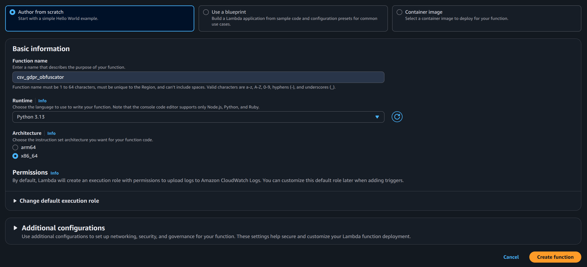
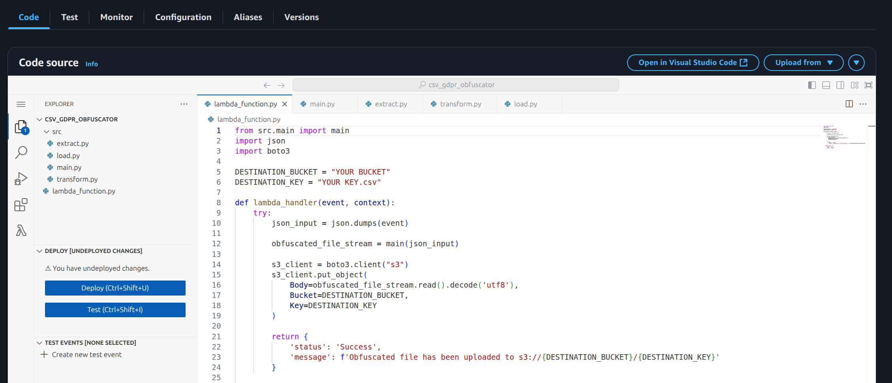
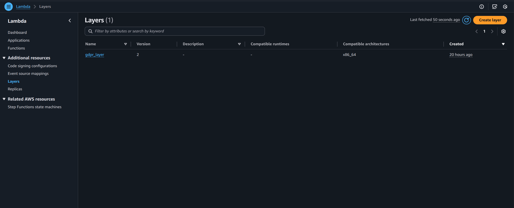
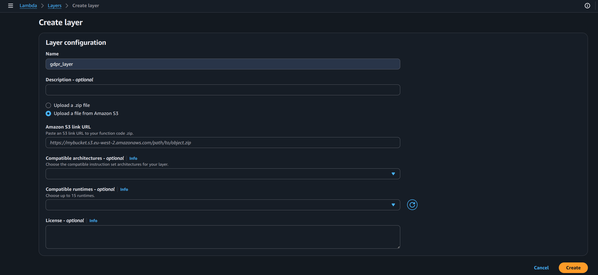
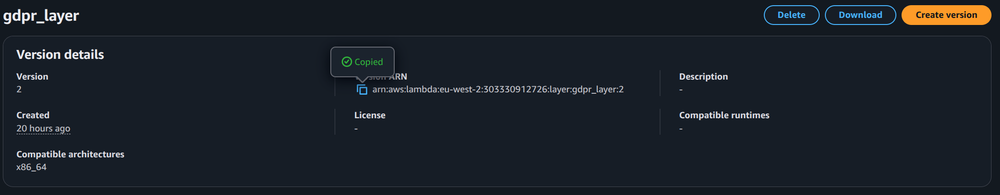
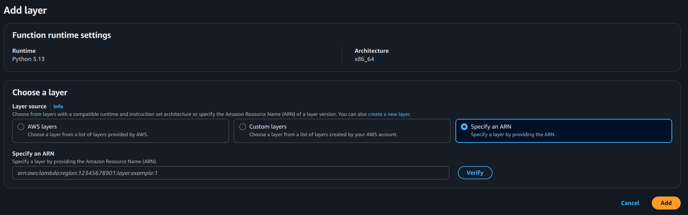
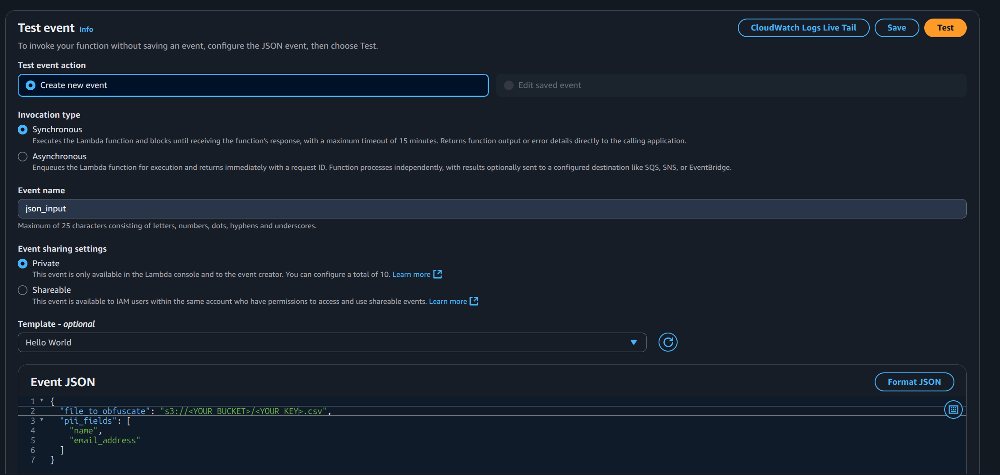
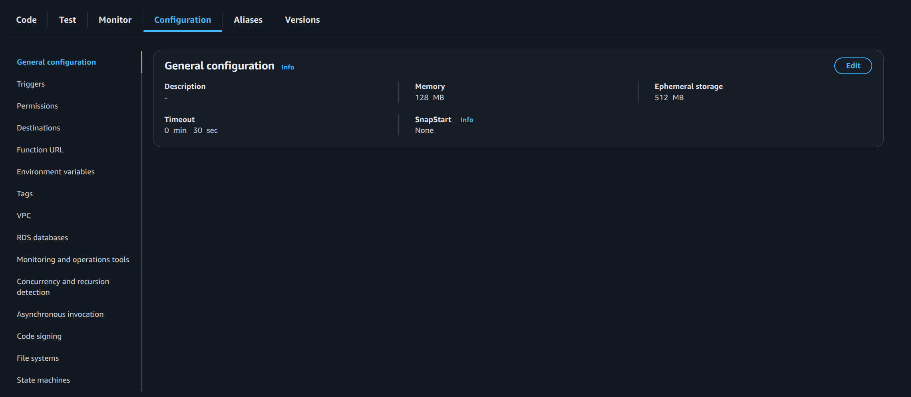
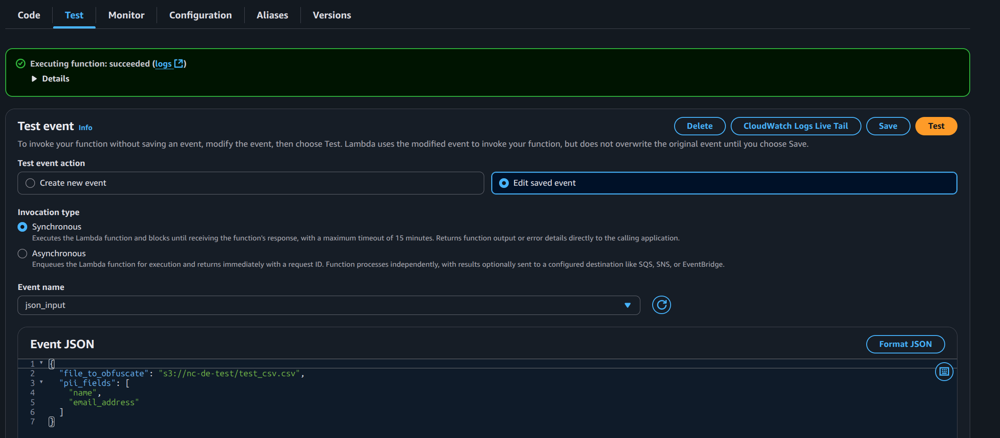

# GDPR Obfuscator
The GDPR Obfuscator provides a simple way to remove Personally Identifiable Information (PII) from `.csv` files stored in AWS S3.

It can be run from the Command Line or uploaded to AWS Lambda.

## Table of Contents

- [App Overview](#app-overview)
- [Invocation](#invocation)
- [Using from the Command Line](#using-from-the-command-line)
- [Using with AWS Lambda](#using-with-aws-lambda)
    - [1. Deploy code in AWS Lambda](#1-deploy-code-in-aws-lambda)
    - [2. Deploy Lambda Layer](#2-deploy-lambda-layer)
        - [Create Dependency Package](#create-dependency-package)
        - [Create Lambda Layer](#create-lambda-layer)
    - [3. Create test event json](#3-create-test-event-json)
    - [4. IAM permissions and additional configuration](#4-iam-permissions-and-additional-configuration)
    - [5. Running a test](#5-running-a-test)

## App Overview
This app maintains a clear distinction between Extraction, Transformation, and Loading, with separate scripts in the `src` directory for each. The `main.py` script coordinates the ETL pipeline.

When deployed in Lambda, `lamda_function.py` handles the execution of the GDPR Obfuscator by invoking `main.py`. The `lamda_function.py` script also provides functionality to store the returned obfuscated file to an S3 bucket and key of your choosing.

The `main` function returns a BytesIO stream. When used with Lambda, the stream must first be read and decoded before being uploaded to S3:

```python
# from lambda_function.py

s3_client.put_object(
    Body=obfuscated_file_stream.read().decode('utf8'),
    Bucket=DESTINATION_BUCKET,
    Key=DESTINATION_KEY
    )
```

## Invocation
A `.json` file must be supplied to the Obfuscator, telling it where the original `.csv` is kept, and PII fields that are to be obfuscated.

A template `.json` file is located in the `utility` directory:

```json
{
  "file_to_obfuscate": "s3://<YOUR BUCKET>/<YOUR KEY>.csv",
  "pii_fields": [
    "name",
    "email_address"
  ]
}
```

## Using from the Command Line
Load `main.py` into the python REPL:

```bash
python -i src/main.py
```
Open the `json_input` file, storing it as a variable to supply as an argument to `main.py`:
```python-repl
with open('utility/json_input.json', 'r') as file:
    json_input=file.read()
```
Invoke the `main` function:
```python-repl
obfuscated_file_stream = main(json_input)
```
To read the BytesIO stream in the command line, run the `read()` method and decode it:
```python-repl
obfuscated_csv = obfuscated_file_stream.read().decode('utf8')
print(obfuscated_csv)
```
Then save the `csv` data to a new location:
```python-repl
with open ('<local directory>/<file name.csv>', 'w') as f:
    f.write(obfuscated_csv)
```
## Using with AWS Lambda
To deploy the GDPR Obfuscator in Lambda, 4 parts are needed:
1. deploy GDPR Obfuscator scripts in a lambda function
2. python dependencies zipped into a layer
3. create event json to test our Lambda function
4. IAM permissions and additional configuration
5. running a test

### 1. Deploy code in AWS Lambda
Navigate to the AWS Console in your browser, and find the Lambda service.
- Select:
    - Create function
    - Author from scratch
    - Name your function
        - e.g. csv_gdpr_obfuscator
    - Runtime:
        - Python 3.13
    - Architecture:
        - x86-64
    - Create function



Find the 'Code' tab. Upload all python scripts in the `src` directory, maintaining the directory structure. Upload `lambda_function.py` found in the `lambda` directory, ensuring it's placed at the root for the lambda function. 

Update `DESTINATION_BUCKET` and `DESTINATION_KEY` in `lambda_function.py`. Then click 'Deploy':



### 2. Deploy Lambda Layer
The Obfuscator relies on the following external dependencies:
- boto3
    - communicates with AWS services
- polars
    - performs the obfuscation

These will need to be packaged and zipped, before creating a layer in Lambda. When invoked, this layer is made available to the code that we deployed in the previous step.

#### Create Dependency Package
To create the python dependency package, install the dependencies to a diretory called `python`. To keep things tidy, first navigate to the root of the GDPR Obfuscation tool:
```bash
cd <PROJECT LOCATION>/de-gdpr-obfuscator
pip install --target ./python polars boto3
```
Next, zip the package to a file called `layer.zip`:
```bash
zip -r layer.zip python/
```
#### Create Lambda Layer
With our zipped dependencies, navigate to S3 from the AWS Console. Create a bucket and upload `layer.zip`. Copy the file's url.

Then navigate to Layers from the Lambda Dashboard and select Create Layer:



Create the layer, providing the S3 url of:



With the layer created, copy its ARN:



Navigate to the function, and scroll to the bottom to find the Layers section. Select 'Add a layer'.

Select the option to Specify an ARN. Paste and verify the copied ARN, before clicking Add:


### 3. Create test event json
On the function's page, scroll down to find the 'Test' tab, to create a test event. Enter the name of your bucket and key, and save the test event.



### 4. IAM permissions and additional configuration
Lambda will need permission, both to read the csv file to obfuscate from S3, and write the obfuscated file to S3 too.

Find the Configuration tab and select Permissions from the left-hand menu. Click on the role to take you to IAM.

From here, add the necessary permissions to access the source and destination S3 buckets. Ideally, specify the precise permissions to access the particular buckets.

As a catch all, you can select Add permissions, Attach policies and add `AmazonS3FullAccess`. This will grant the Lambda Function permission to perform any action on any bucket, which will work but does not follow the principle of least privilige.

Finally, navigate back to the Configuration tab of the function, to its General configuration.

Adjust Timeout to 30 seconds, providing enough time for the function to complete its task:



### 5. Running a test

Navigate to the Test tab. Ensuring the `json_input` test event created earlier is selected, run a test. A 1.4MB file will take approximately 7 seconds to complete, with a billed duration closer to 8 seconds.

